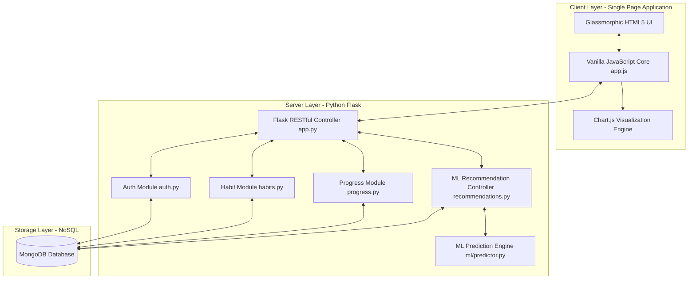

# RoutineX — Smart Habit Tracker with AI Recommendations
## Academic & Technical Project Report

---

## 1. Executive Summary
**RoutineX** is a full-stack, state-of-the-art web application designed to help individuals build, sustain, and optimize their daily habits. Unlike traditional habit trackers that function as simple passive checklists, RoutineX incorporates an **intelligent, data-driven recommendation engine** powered by **Machine Learning (Linear Regression)**. The system dynamically analyzes users' unique historical behavioral patterns—such as time of day, completion rates, weekly trends, and streak resilience—to offer actionable, personalized insights. 

Built with a modern, dark-themed, glassmorphic single-page frontend, a lightweight Flask RESTful API backend, and a robust MongoDB NoSQL database, RoutineX achieves the perfect balance of visual elegance, performance, and analytical intelligence.

---

## 2. Introduction & Problem Statement
In behavioral psychology, habit building is recognized as a process of consistency and positive reinforcement. However, the majority of active users abandon habit tracking apps within the first three weeks due to:
1. **Lack of Personalization**: Generic templates that do not adapt to individual schedules.
2. **Actionable Blindness**: Systems that track completion but fail to inform the user *when* and *how* they are most successful.
3. **Friction of Use**: Clunky user interfaces that make tracking feel like a chore rather than a rewarding routine.

**RoutineX** solves these issues by providing a premium, interactive user interface paired with a predictive analysis engine. By modeling habits as statistical data points, the application highlights failure vectors, predicts daily completion probability, and suggests specific corrective actions (e.g., shifting meditation from evenings to mornings to boost success).

---

## 3. System Architecture
RoutineX utilizes a decoupled full-stack architecture optimized for low latency, smooth animation rendering, and modular scalability.



### 3.1 Frontend Architecture (SPA)
The frontend is built as a highly responsive **Single-Page Application (SPA)** using **HTML5, CSS3**, and **Vanilla JavaScript** (ES6+):
- **Glassmorphism UI**: Uses HSL-based color tokens, modern typography (`Inter`), backdrop-filters, subtle glow-orbs, and custom transitions to deliver a premium, high-tech dark/light aesthetics.
- **Dynamic View Engine**: JavaScript manages the active DOM sections (Dashboard, My Habits, Insights, Progress) dynamically without requiring page reloads, providing a desktop-app-like experience.
- **Chart.js Integration**: Renders clean, interactive SVG/Canvas charts illustrating completion trends (line charts) and category breakdowns (doughnut charts).

### 3.2 Backend Architecture (REST API)
The backend is powered by **Python Flask**, structured as a lightweight API server:
- **Modular Routing**: Separates business logic into specific blueprints:
  - `auth.py`: Handles user signup, session-based login, and cryptographic secure password hashing via `Flask-Bcrypt`.
  - `habits.py`: Manages full CRUD (Create, Read, Update, Delete) operations for habits and daily completion toggles.
  - `progress.py`: Collects and aggregates completion history to feed the analytics charts.
  - `recommendations.py`: Communicates with the ML model and serves recommendations.
- **Session Security**: Session cookies keep users securely authenticated.

### 3.3 Database Architecture (MongoDB NoSQL)
**MongoDB** was chosen as the database layer because its document-oriented structure naturally models hierarchical, rapidly changing user habits:
- **Schemaless Flexibility**: Allows direct storage of habit metadata (e.g., customizable colors, categories, target times).
- **Relational Integrity via Document References**: Maps `user_id` and `habit_id` to establish clean operational relations without heavy table joins, maximizing API response speeds.
- **Indexing**: Ensures optimized query performance for rapid historical lookups and daily habit checks.

---

## 4. Machine Learning Recommendation Engine
The heart of RoutineX is its personalized recommendation model, which utilizes **Linear Regression** via Python's `scikit-learn` to score and optimize user behavior.

### 4.1 Feature Engineering
The model transforms raw MongoDB activity logs into seven high-value numerical features for each habit:

| Feature Name | Description | Intuition |
| :--- | :--- | :--- |
| **Completion Rate** | Fraction of days completed over the last 30 days. | Core baseline of habit strength. |
| **Average Hour** | The average time of day (0-23) the habit was logged. | Indicates preferred time frames. |
| **Hour Std Dev** | The standard deviation of the completion hour. | Lower values indicate a highly regular time-based routine. |
| **Day Consistency** | Statistical preference index for specific days of the week. | Identifies if a habit is a weekend/weekday preference. |
| **Frequency Regularity**| The standard deviation of days between completions. | Tracks evenness of interval spacing. |
| **Streak Ratio** | Current active streak divided by all-time best streak. | Indicates current motivational momentum. |
| **Total Completions** | Normalized lifetime log counts. | Represents the long-term depth of the routine. |

### 4.2 Mathematical Modeling
The model treats habit performance as a multi-variable regression problem:

$$\text{Success Probability } (Y) = \beta_0 + \beta_1 X_1 + \beta_2 X_2 + \dots + \beta_n X_n + \epsilon$$

Where:
- $X_i$ represents the engineered features (Completion Rate, Hour Consistency, etc.).
- $\beta_i$ represents the learned weights, showing the impact of each variable.
- $Y$ is the predicted success probability (mapped to a $0\% - 100\%$ scale).

### 4.3 Actionable Insights Pipeline
The output probabilities are processed by an intelligent rules engine in `routes/recommendations.py` to formulate human-readable, highly actionable suggestions:
- **Best Time of Day Recommendation**: Analyzes the average completion hour of successful days and suggests locking the habit into that block.
- **Critical Habits Alarm**: Identifies habits with dropping success probabilities (below $40\%$) and tags them with high-priority warnings.
- **Time Consistency Index**: Tells the user whether high variation in completion times is hurting their overall streak, urging them to build a standard routine.

---

## 5. Database Schema Specification
The MongoDB schema structure is composed of three primary collections:

### 5.1 Users Collection
Stores account information and visual UI preferences.
```json
{
  "_id": { "$oid": "603f9011ab3cd92490df11a1" },
  "name": "Alex Mercer",
  "email": "alex@routinex.com",
  "password": "$2b$12$R9J12.DzSg1hW8G1.YJbOe0Z9kR3m2L1K5...", 
  "created_at": "2026-01-15T08:00:00",
  "preferences": {
    "theme": "dark",
    "notifications": true
  }
}
```

### 5.2 Habits Collection
Maintains current metadata, current streaks, and cumulative records for each habit.
```json
{
  "_id": { "$oid": "603f90b8ab3cd92490df11a2" },
  "user_id": "603f9011ab3cd92490df11a1",
  "name": "Read Tech Journal",
  "category": "learning",
  "frequency": "daily",
  "target_time": "21:30",
  "description": "Read 3 tech articles to stay updated",
  "color": "#8B5CF6",
  "created_at": "2026-01-15T08:15:00",
  "streak": 7,
  "best_streak": 14,
  "total_completions": 28,
  "is_active": true
}
```

### 5.3 Activity Logs Collection
An append-only historical log record of every successful completion event.
```json
{
  "_id": { "$oid": "603f9202ab3cd92490df11a7" },
  "user_id": "603f9011ab3cd92490df11a1",
  "habit_id": "603f90b8ab3cd92490df11a2",
  "date": "2026-04-29",
  "completed_at": "2026-04-29T21:32:15",
  "hour": 21,
  "day_of_week": 3
}
```

---

## 6. Complete API Specifications

| Method | Endpoint | Auth | Request Body (JSON) | Success Response (200/201) | Description |
| :--- | :--- | :---: | :--- | :--- | :--- |
| **`POST`** | `/api/register` | No | `{"name", "email", "password"}` | `{"message": "User registered"}` | Registers a new user. |
| **`POST`** | `/api/login` | No | `{"email", "password"}` | `{"message": "Logged in", "user"}` | Initiates session. |
| **`POST`** | `/api/logout` | Yes | *None* | `{"message": "Logged out"}` | Clears session cookie. |
| **`GET`** | `/api/me` | Yes | *None* | `{"id", "name", "email", "pref"}` | Returns active user profile. |
| **`POST`** | `/api/add-habit` | Yes | `{"name", "category", "frequency", "target_time", "color", "description"}` | `{"message": "Habit added", "habit"}` | Creates a new habit card. |
| **`PUT`** | `/api/edit-habit/<id>`| Yes | `{"name", "category", ...}` | `{"message": "Habit updated", "habit"}` | Modifies a habit. |
| **`DELETE`**| `/api/delete-habit/<id>`| Yes | *None* | `{"message": "Habit deleted"}` | Removes habit & logs. |
| **`GET`** | `/api/get-habits` | Yes | *None* | `[{"habit_data"}, ...]` | Fetches active habits. |
| **`POST`** | `/api/track-habit` | Yes | `{"habit_id", "date"}` | `{"message": "Tracked", "completed"}`| Toggles daily completion status. |
| **`GET`** | `/api/progress` | Yes | *None* | `{"completion_rate", "charts"}` | Compiles analytics data. |
| **`GET`** | `/api/get-recommendations`| Yes | *None* | `{"recommendations", "model_trained"}`| Generates ML suggestions. |
| **`POST`** | `/api/retrain-model` | Yes | *None* | `{"message": "Model retrained"}` | Forces scikit-learn training. |

---

## 7. Development & Deployment Procedures

### 7.1 Local Deployment (PowerShell / Terminal)
1. **Repository Setup**: Clone and navigate into the root folder.
2. **Environment Variable Configuration**: Create a `.env` file from the provided `.env.example`:
   ```ini
   PORT=5000
   MONGO_URI=mongodb://localhost:27017/routinex
   SECRET_KEY=your_secure_flask_session_key
   ```
3. **Virtual Environment & Dependencies**:
   ```bash
   python -m venv venv
   .\venv\Scripts\activate
   pip install -r requirements.txt
   ```
4. **Database Seeding**:
   Create indexes and insert artificial tracking history to train the machine learning model immediately:
   ```bash
   python setup_db.py --seed
   ```
   *Note: This generates a demo user with realistic 30-day habits (`demo@routinex.com` / `demo123`).*
5. **Start Flask Server**:
   ```bash
   python app.py
   ```
   Access application at: **`http://localhost:5000`**

### 7.2 Core Verification Checklist
- **Database Connection**: Flask logs validation checking connection to MongoDB client successfully.
- **Model Training**: Verify `/api/retrain-model` response completes without exceptions (implies `scikit-learn` has run regression matrices successfully).
- **Responsive Layouts**: Scaled and tested on modern viewport sizes ranging from 375px (mobile) to 1920px (full HD).

---

## 8. Conclusion & Future Enhancements
RoutineX establishes a robust foundation for a personalized wellness companion. By demonstrating how data science models like Linear Regression can run directly alongside a Flask backend, the project opens massive possibilities for future expansion:
1. **Predictive Habit Scheduling**: Integrating real-time weather, device notifications, or calendar event overlaps using more advanced classifiers (e.g., Random Forests).
2. **Social accountability networks**: Multiplayer habits streaks, shared tracking rooms, and leaderboard incentives.
3. **Conversational AI Coaching**: Integrating Gemini or localized LLMs to talk to the user, understand *why* they missed a habit, and provide custom coaching.

---
**Report Prepared for:** RoutineX Core Deliverable Archive  
**Version:** 1.0.0 (Release-Ready)  
**Authors:** Lead Full-Stack Developer & Data Architect  
